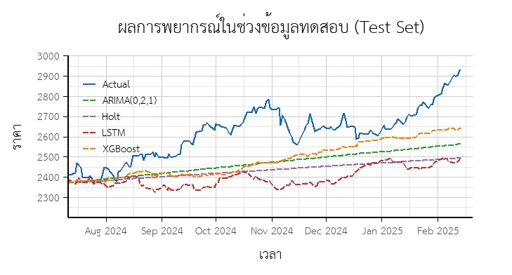

# สรุปผลการศึกษา

จากการเปรียบเทียบประสิทธิภาพการพยากรณ์ราคาทองคำภายใต้สถานการณ์สงครามรัสเซียและยูเครนโดยใช้วิธี

Time Series 2 วิธี

- Holt's Exponentail Smoothing
- ARIMA (0,2,1) จากวิธี ARIMA

และ Machine Learning 2 วิธี

- XGBoost
- LSTM

โดยการใช้ค่า RMSE MAPE MAD(MAE) ซึ่งเป็นสถิติสำหรับวัดความคลาดเคลื่อนจากการพยากรณ์ ทั้ง 3 ตัวชี้วัดสามารถตีความว่าค่าที่ใกล้ 0 หมายถึงประสิทธิภาพดีกว่า(ความคลาดเคลื่อนต่ำกว่า)

| Model         |       RMSE |        MAD |  MAPE(%) |
| :------------ | ---------: | ---------: | -------: |
| Holt's        |     210.53 |     186.17 |     6.95 |
| ARIMA         |     173.18 |     151.26 |     5.64 |
| **_XGBoost_** | **156.49** | **132.55** | **4.95** |
| LSTM          |     246.58 |     221.61 |     8.29 |

- พบว่าวิธีการพยากรณ์ที่ดีที่สุดคือ XGBoost รองลงมาคือ ARIMA(0,2,1) Holt's และ LSTM ตามลำดับ แตกต่างจากสมมติฐานที่ว่าว่า LSTM จะมีประสิทธิภาพสูงสุด สาเหตุอาจมาจากจำนวนข้อมูลที่มีน้อย ซึ่งอาจทำให้โมเดลประเภทการเรียนรู้เชิงลึกไม่สามารถทำความเข้าใจรูปแบบได้อย่างมีประสิทธิภาพ

- อย่างไรก็ตามทุกวิธีการพยากรณ์ไม่ได้ให้ประสิทธิภาพการพยากรณ์ที่น่าพึงพอใจมากนัก เนื่องจากค่าพยากรณ์ที่ได้ จะเห็นว่าสามารถพยากรณ์ได้เพียงแนวโน้มภาพรวมในอนาคต เพราะตลอดช่วงเวลาทดสอบ จะเห็นว่าค่าจริงและค่าพยากรณ์ยังแตกต่างกันอยู่ในระดับหลักร้อยดอลลาร์ ปัญหานี้อาจแก้ไข้ได้โดยการเพิ่มตัวแปรภายนอก เช่น สินทรัพย์ความสัมพันธ์สูง หรือ ดัชนีเศรษฐกิจอื่นๆ โดยสามารถประยุกต์ใช้โมเดล ARIMAX (โมเดล ARIMA ที่สามารถเพิ่มปัจจัยภายนอก) หรือ เพิ่มตัวแปรไปยังโมเดล Machine Learning ซึ่งอาจทำให้การพยากรณ์ด้วยวิธ๊ Machine Learning มีประสิทธิภาพสูงขึ้น
